<div align="center">
  
  <h1>OrganizaGrana</h1>
  <p><b>Gestão financeira pessoal, planejamento orçamentário inteligente e listas de compras integradas com Inteligência Artificial.</b></p>

  <p>
    
    
    
    
    
  </p>
</div>

---

<!-- ================================================================= -->
<!-- GALERIA DE TELAS DO APLICATIVO                                    -->
<!-- ================================================================= -->

<div align="center">
  <h2>Interface e Telas do Aplicativo</h2>
  <p><i>Visão geral da interface do OrganizaGrana.</i></p>
  <p><sub><b>Aviso:</b> Todos os dados, valores, faturas e transações exibidos nas imagens são estritamente fictícios (dados mockados) para fins demonstrativos e não refletem faturamento, receitas ou informações financeiras reais.</sub></p>
</div>

<div align="center">
  <table>
    <tr>
      <td align="center" width="33%">
        <b>Dashboard e Resumo</b><br/><br/>
        
      </td>
      <td align="center" width="33%">
        <b>Cartões e Faturas</b><br/><br/>
        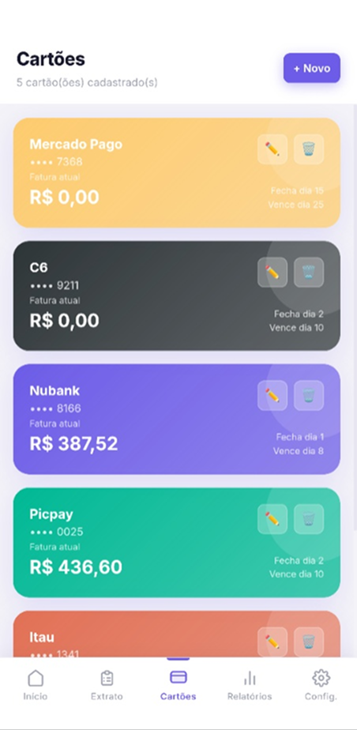
      </td>
      <td align="center" width="33%">
        <b>Extrato e Contas a Pagar</b><br/><br/>
        
      </td>
    </tr>
    <tr>
      <td align="center" width="33%">
        <b>Lançamento de Despesa</b><br/><br/>
        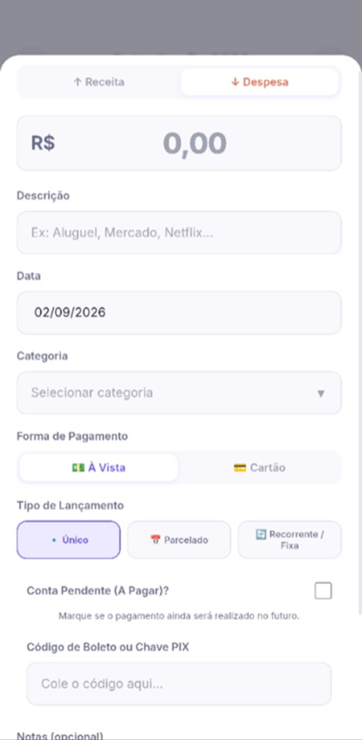
      </td>
      <td align="center" width="33%">
        <b>Lançamento de Receita</b><br/><br/>
        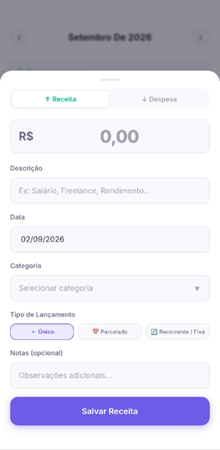
      </td>
      <td align="center" width="33%">
        <b>Leitura de Comprovantes com IA</b><br/><br/>
        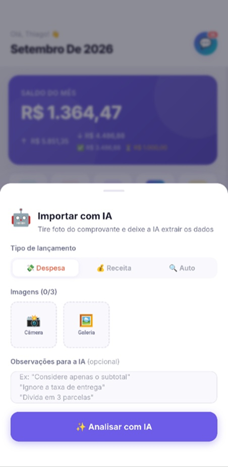
      </td>
    </tr>
    <tr>
      <td align="center" width="33%">
        <b>Listas de Compras</b><br/><br/>
        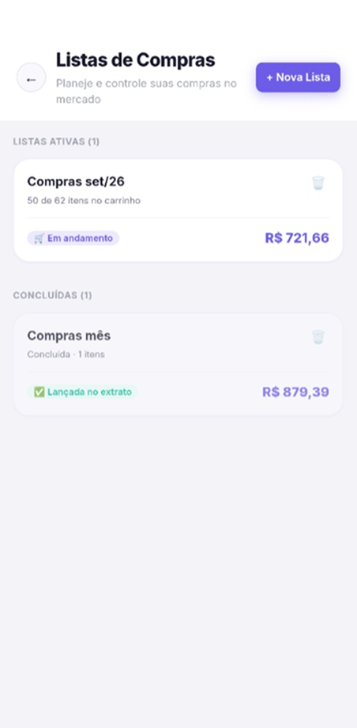
      </td>
      <td align="center" width="33%">
        <b>Carrinho em Tempo Real</b><br/><br/>
        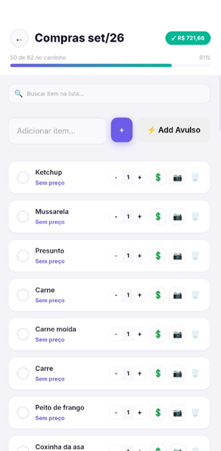
      </td>
      <td align="center" width="33%">
        <b>Consultor Financeiro IA</b><br/><br/>
        
      </td>
    </tr>
    <tr>
      <td align="center" width="33%">
        <b>Gastos por Categoria</b><br/><br/>
        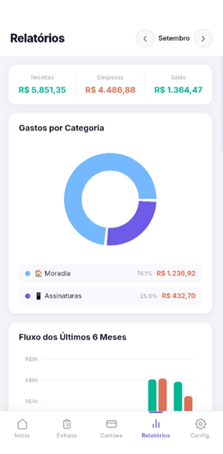
      </td>
      <td align="center" width="33%">
        <b>Fluxo de Caixa Semestral</b><br/><br/>
        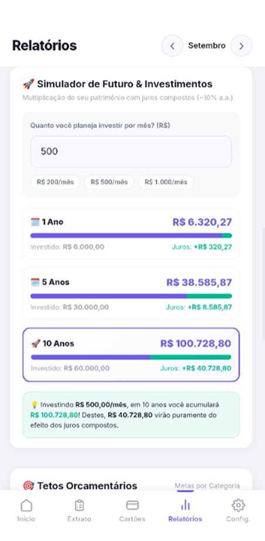
      </td>
      <td align="center" width="33%">
        <b>Simulador de Investimentos</b><br/><br/>
        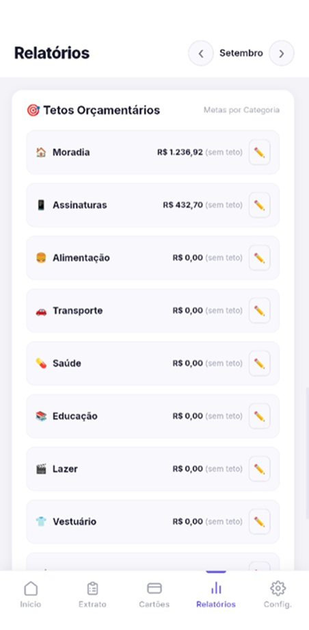
      </td>
    </tr>
    <tr>
      <td align="center" width="33%">
        <b>Configurações e Chaves de IA</b><br/><br/>
        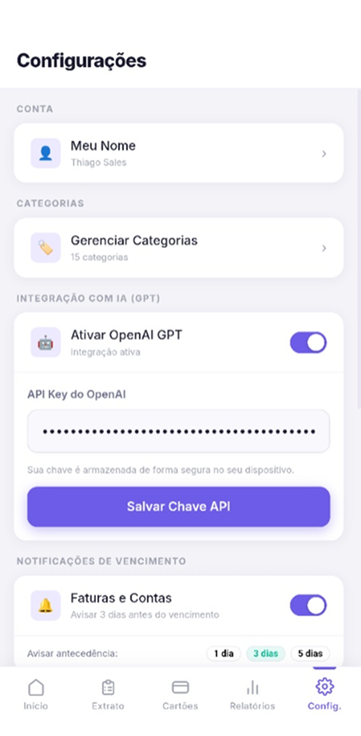
      </td>
      <td align="center" width="33%">
        <b>Tetos e Categorias</b><br/><br/>
        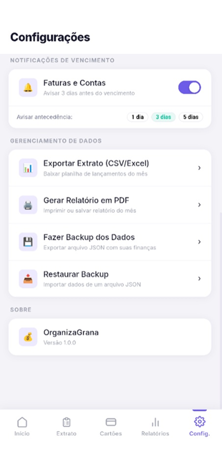
      </td>
      <td align="center" width="33%">
        <!-- Espaço reservado -->
      </td>
    </tr>
  </table>
</div>

> [!NOTE]
> **Dados Demonstrativos:** Todas as informações, saldos, transações, nomes de instituições e valores exibidos nas capturas de tela acima são dados fictícios (mockados), criados exclusivamente para demonstrar o layout, a interface e o funcionamento dos componentes do aplicativo. Eles não representam faturamento, receitas ou movimentações financeiras reais.

---

> [!IMPORTANT]
> ### Código-fonte disponível para colaboração — não é Open Source
>
> O código deste repositório é disponibilizado publicamente para **transparência, avaliação técnica e contribuição com o projeto oficial**.
>
> **Permitido:** visualizar, fazer fork/clone, modificar, compilar e executar localmente na medida estritamente necessária para desenvolver e testar Pull Requests destinados ao projeto oficial.
>
> **Não permitido:** utilizar o aplicativo para uso pessoal ou de terceiros, produção, uso interno, fins comerciais, hospedar uma versão própria, distribuir builds/APKs ou criar projetos paralelos/independentes baseados neste código.
>
> Consulte **[LICENSE](LICENSE)**, **[CONTRIBUTING.md](CONTRIBUTING.md)** e **[CLA.md](CLA.md)** antes de utilizar ou contribuir com o código.

---

## Sobre o Projeto

A proposta do **OrganizaGrana** foi construir uma ferramenta de gestão financeira completa, prática e sem custos de assinatura. Ele reúne tudo o que é necessário para controlar gastos, organizar rotinas de compras e planejar o orçamento, operando de maneira **100% offline** com banco de dados local (SQLite) e com suporte opcional a **Inteligência Artificial (OpenAI GPT e Google Gemini)** no formato *Bring Your Own Key* (BYOK).

Tudo foi desenvolvido de forma ágil utilizando **Apache Cordova**, **React** e **Vite**, combinando a leveza do ecossistema web com a robustez e fluidez de um ambiente mobile nativo.

---

## Funcionalidades Detalhadas

### Painel Geral (Dashboard)
* **Resumo Mensal Consolidado:** visão imediata do saldo acumulado do mês, entradas totais, saídas totais, despesas já quitadas e saldo de contas pendentes.
* **Faturas em Destaque:** carrossel dinâmico com faturas abertas, limite consumido, identificação visual da instituição e dias até o vencimento.
* **Atalhos Rápidos:** ações em um toque para nova receita, nova despesa, cartões, listas de compras e importação por IA.
* **Lançamentos Recentes:** histórico das últimas movimentações com identificação por categoria, forma de pagamento e status.

<div align="center">
  
</div>

---

### Cartões de Crédito e Faturas
* **Múltiplos Cartões:** cadastro flexível e personalização visual de instituições (Nubank, Itaú, C6 Bank, Mercado Pago, PicPay, etc.).
* **Controle Dinâmico de Ciclos:** gestão de dia de fechamento e dia de vencimento com projeção automática das compras no mês correspondente da fatura.
* **Fatura em Tempo Real:** consolidação de todos os gastos lançados na modalidade crédito vinculados a cada cartão.

<div align="center">
  
</div>

---

### Extrato e Lançamentos
* **Histórico Completo:** visualização cronológica agrupada por datas, com busca textual instantânea e filtros rápidos (Todos, Receitas, Despesas).
* **Modalidades de Lançamento:**
  * **Pontual (Único):** despesas e receitas pontuais.
  * **Parcelado:** divisão automática em parcelas com acompanhamento de progresso (ex: 1/10).
  * **Recorrente / Fixo:** despesas e receitas contínuas (mensalidades, assinaturas, salários) projetadas automaticamente.
* **Contas a Pagar e Boletos:** marcação de despesas pendentes com campos dedicados para código de barras de boletos e chave PIX, permitindo cópia em um toque e liquidação direta.

<div align="center">
  
  
  
</div>

---

### Inteligência Artificial Integrada (GPT e Gemini)
* **Leitura Automática de Comprovantes e Etiquetas:** envio de fotos ou capturas de notas fiscais, faturas e etiquetas de produtos (com suporte a até 3 imagens simultâneas) para extração inteligente de valores, datas, descrições e categorias.
* **Instruções Personalizadas no Prompt:** possibilidade de adicionar notas e regras para a IA (ex: "divida em 2 vezes", "desconsidere o frete").
* **Consultor Financeiro Interativo:** assistente em chat para diagnóstico financeiro, orientação de metas e análise de consumo.
* **Privacidade e Modelo BYOK:** o aplicativo **não fornece** chaves de API. O usuário deve gerar sua chave na [documentação da OpenAI](https://platform.openai.com/docs/quickstart) ou no [Google AI Studio](https://aistudio.google.com/) e configurá-la diretamente nas preferências do app. As credenciais e dados permanecem salvos exclusivamente no armazenamento local do aparelho.

<div align="center">
  
  
</div>

---

### Listas de Compras Integradas
* **Planejamento de Mercado:** criação, edição, acompanhamento e arquivamento de listas de compras completas.
* **Gestão e Controle de Itens:** adição e remoção de produtos com definição de quantidade, valor unitário e anexação de fotos de produtos ou etiquetas de preço.
* **Reconhecimento de Preços por IA via Foto:** envio da foto do produto ou da etiqueta de preço na gôndola para a IA analisar a imagem e extrair o valor unitário correto automaticamente, restando ao usuário apenas definir a quantidade.
* **Lançamento Rápido de Itens Avulsos:** registro ágil de itens ou categorias informando múltiplos preços e quantidades em sequência — ideal para momentos de correria no supermercado ou ao pegar itens de marcas e valores diferentes sem burocracia.
* **Calculadora de Carrinho em Tempo Real:** cálculo automático do total acumulado conforme os produtos são marcados no carrinho durante as compras.
* **Conversão Automática em Despesa:** ao concluir a compra, um único toque converte o valor total da lista diretamente em uma despesa registrada no extrato mensal.

<div align="center">
  
  
</div>

---

### Relatórios e Planejamento Patrimonial
* **Gastos por Categoria:** visualização gráfica detalhando percentuais e valores alocados por categoria.
* **Fluxo de Caixa Semestral:** comparativo de receitas versus despesas nos últimos 6 meses para acompanhamento de evolução financeira.
* **Tetos Orçamentários:** definição de limites de gastos por categoria (Alimentação, Moradia, Lazer, etc.) com alertas visuais para prevenção de estouros.
* **Simulador de Investimentos:** projeção patrimonial com aportes mensais a juros compostos com cenários para 1 ano, 5 anos e 10 anos.

<div align="center">
  
  
  
</div>

---

### Notificações e Gestão de Dados
* **Lembretes de Vencimento:** notificações locais automáticas para contas a pagar e fechamento de faturas com antecedência configurável (1, 3 ou 5 dias antes).
* **Exportação Completa:** geração de relatórios em PDF e planilhas em CSV/Excel.
* **Backup e Restauração Local:** exportação e importação manual completa das finanças em arquivo JSON para migração ou segurança.
* **Gestão de Categorias e Limites:** personalização de cores, ícones e tetos mensais.

<div align="center">
  
  
</div>

---

## Tecnologias e Arquitetura

O projeto adota uma arquitetura mobile híbrida focada em simplicidade e desempenho:

| Camada | Tecnologia | Finalidade |
|---|---|---|
| **Core / UI** | [React](https://reactjs.org/) (ES6+) | Componentização reativa e gestão de ciclo de vida |
| **Bundler & DevServer** | [Vite](https://vitejs.dev/) | HMR instantâneo e build otimizado |
| **Mobile Runtime** | [Apache Cordova](https://cordova.apache.org/) | Ponte nativa com hardware Android (câmera, notificações, armazenamento) |
| **Banco de Dados** | SQLite (`cordova-sqlite-storage`) | Persistência relacional 100% offline no dispositivo |
| **Estilização** | Vanilla CSS (CSS Variables) | Design System sob medida, responsivo, com suporte a temas Dark/Light |
| **Inteligência Artificial** | OpenAI API / Google Gemini API | Extração inteligente de notas e consultoria financeira |

---

## Ambiente de Desenvolvimento

> [!NOTE]
> As instruções a seguir destinam-se exclusivamente a desenvolvedores interessados em avaliar o projeto tecnicamente ou contribuir com melhorias via Pull Request para o Repositório Oficial.

### Pré-requisitos
* **Node.js** (versão 18 ou superior recomendada)
* **NPM**, Yarn ou PNPM
* **Android Studio e SDK** (caso deseje compilar e gerar o APK para Android)

---

### Executando no Navegador (Web / Layout)

1. Faça o fork/clone do repositório conforme descrito em **[CONTRIBUTING.md](CONTRIBUTING.md)**:
   ```bash
   git clone https://github.com/SEU-USUARIO/app-financas.git
   cd app-financas
   ```

2. Instale as dependências:
   ```bash
   npm install
   ```

3. Inicie o servidor Vite:
   ```bash
   npm run dev
   ```

4. Abra `http://localhost:5173` no navegador.  
   *(Dica: acione o Modo Dispositivo no DevTools com `F12` para simular as proporções de uma tela mobile).*

> **Atenção:** Em ambiente web/desktop, o app utiliza o fallback do `WebSQL`/LocalStorage. Funcionalidades nativas como Notificações Push Locais e Área de Transferência de hardware comportam-se de forma plena apenas no dispositivo real.

---

### Compilando para Android (Geração de APK)

1. Certifique-se de que a variável `ANDROID_HOME` aponta para o seu Android SDK.
2. Adicione a plataforma Android (se ainda não adicionada):
   ```bash
   npx cordova platform add android
   ```
3. Execute o build integrado (Vite + Cordova):
   ```bash
   npm run build-cordova
   ```
   *(O executável `.apk` de debug será gerado em `platforms/android/app/build/outputs/apk/debug/app-debug.apk`).*

---

## Como Contribuir

Contribuições focadas em correções de bugs, melhorias de performance e novas ideias são bem-vindas no projeto oficial.

Antes de abrir o seu Pull Request, é obrigatório ler:
* **[CONTRIBUTING.md](CONTRIBUTING.md)** — fluxo de branches, convenções de commits e passos de submissão;
* **[CLA.md](CLA.md)** — termos do Contributor License Agreement;
* **[LICENSE](LICENSE)** — restrições e termos da licença source-available.

---

## Licença e Direitos Autorais

**Copyright © 2026 OrganizaGrana / SalesCode. Todos os direitos reservados.**

Este repositório utiliza uma **licença proprietária source-available**. A disponibilização pública do código-fonte não constitui licenciamento Open Source (não permite fork para uso independente, redistribuição, cópia ou exploração comercial). O uso do código é estritamente restrito à avaliação técnica e desenvolvimento de contribuições destinadas ao projeto oficial.

Para consultar o texto integral, acesse o arquivo **[LICENSE](LICENSE)**.
